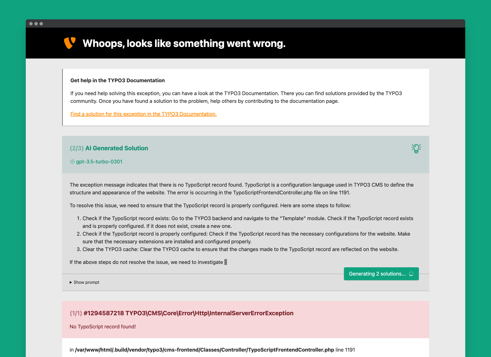

<div align="center">



# TYPO3 extension `solver`

[](https://coveralls.io/github/eliashaeussler/typo3-solver)
[](https://codeclimate.com/github/eliashaeussler/typo3-solver/maintainability)
[](https://github.com/eliashaeussler/typo3-solver/actions/workflows/cgl.yaml)
[](https://github.com/eliashaeussler/typo3-solver/actions/workflows/tests.yaml)
[](https://extensions.typo3.org/extension/solver)
[](https://typo3.slack.com/archives/C04Q3440HS6)

</div>

An extension for TYPO3 CMS to solve exceptions with AI generated solutions.
It uses the [OpenAI PHP client][1] to send a prompt to a configured model
and uses the responded completion as solution. Several completion attributes
(model, tokens, temperature, number of completions) are configurable. It also
provides a console command to solve problems from command line.

## 🚀 Features

* Extended exception handler with AI generated solutions
* Configurable AI completion attributes (model, tokens, temperature, number of completions)
* Caching integration for solved problems
* Command to solve problems from command line
* Customizable solution providers and prompts
* Compatible with TYPO3 11.5 LTS, 12.4 LTS and 13.3

## 🔥 Installation

### Composer

[](https://packagist.org/packages/eliashaeussler/typo3-solver)
[](https://packagist.org/packages/eliashaeussler/typo3-solver)

```bash
composer require eliashaeussler/typo3-solver
```

### TER

[](https://extensions.typo3.org/extension/solver)
[](https://extensions.typo3.org/extension/solver)

Download the zip file from
[TYPO3 extension repository (TER)](https://extensions.typo3.org/extension/solver).

## 📙 Documentation

Please have a look at the
[official extension documentation](https://docs.typo3.org/p/eliashaeussler/typo3-solver/main/en-us/).

## 💎 Credits

The extension icon ("lightbulb-on") is a modified version of the original
[`actions-lightbulb-on`][2] icon from TYPO3 core. In addition, the icons
[`actions-calendar`][3], [`actions-cpu`][4], [`actions-debug`][5],
[`actions-exclamation-triangle-alt`][6] and [`spinner-circle`][7] from
TYPO3 core are used. All icons are originally licensed under [MIT License][8].

This project is highly inspired by the article [*Fix your Laravel exceptions with AI*][9]
by [Marcel Pociot][10].

In addition, I'd like to thank [Nuno Maduro][11] and all contributors
of the [`openai-php/client`][1] library for this beautiful piece of code.

## ⭐ License

This project is licensed under [GNU General Public License 2.0 (or later)](LICENSE.md).

[1]: https://github.com/openai-php/client
[2]: https://typo3.github.io/TYPO3.Icons/icons/actions/actions-lightbulb-on.html
[3]: https://typo3.github.io/TYPO3.Icons/icons/actions/actions-calendar.html
[4]: https://typo3.github.io/TYPO3.Icons/icons/actions/actions-cpu.html
[5]: https://typo3.github.io/TYPO3.Icons/icons/actions/actions-debug.html
[6]: https://typo3.github.io/TYPO3.Icons/icons/actions/actions-exclamation-triangle-alt.html
[7]: https://typo3.github.io/TYPO3.Icons/icons/spinner/spinner-circle.html
[8]: https://github.com/TYPO3/TYPO3.Icons/blob/main/LICENSE
[9]: https://beyondco.de/blog/ai-powered-error-solutions-for-laravel
[10]: https://pociot.dev/
[11]: https://nunomaduro.com/
